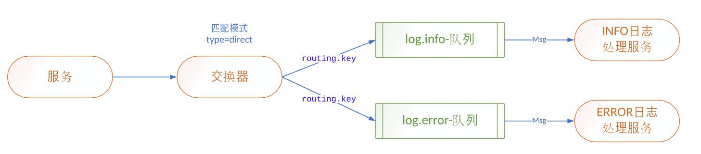
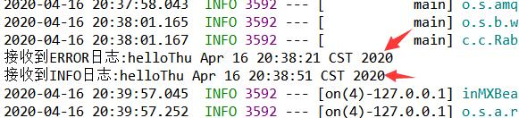

# 交换器direct模式

## 业务场景：系统日志处理场景
1. 微服务产生的日志，交给日志服务器处理
2. 日志处理服务器有4个服务，分别为DEBUG、INFO、WARN、ERROR等
3. 服务直接的通信采用direct（发布订阅）

## provider(生产者)端代码

#### 生产者配置
```
spring.application.name=springboot-amqp
server.port=8080
spring.rabbitmq.host=3.132.215.12
spring.rabbitmq.port=5672
spring.rabbitmq.username=coffeeliu
spring.rabbitmq.password=111111
#设置交换器
rabbit.exchange=log.direct
```

#### sender.java
```
@Component
public class Sender {
	
	@Autowired
	private AmqpTemplate rabbitTemplate;
	
	@Value("${rabbit.exchange}")
	private String exchange;
	
	public void send() throws InterruptedException{
		String msg="hello"+new Date();
		this.rabbitTemplate.convertAndSend(this.exchange,"log.info.routing.key", msg);
	}
```
#### 测试代码
```
@SpringBootTest
class RabbitMqDirectProviderApplicationTests {

	@Autowired
	private Sender sender;
	
	@Test
	public void send() throws InterruptedException {
			this.sender.send();
			
	}

```
## consumer(消费者)代码

#### 消费者配置
```
spring.application.name=springboot-amqp
server.port=8080
spring.rabbitmq.host=3.132.215.12
spring.rabbitmq.port=5672
spring.rabbitmq.username=coffeeliu
spring.rabbitmq.password=111111
#设置交换器
rabbit.exchange=log.direct
#设置队列名
rabbit.queue.info=log.info
#设置路由键
rabbit.queue.info.routing.key=log.info.routing.key
rabbit.queue.error=log.error
rabbit.queue.error.routing.key=log.error.routing.key
```
#### ErrorReceiver.java
```
@Component
@RabbitListener(bindings=@QueueBinding(
		value= @Queue(value="${rabbit.queue.error}",autoDelete="true"),
		exchange=@Exchange(value="${rabbit.exchange}",type=ExchangeTypes.DIRECT),
		key="${rabbit.queue.error.routing.key}"
		)
		)
public class ErrorReceiver {
	
	@RabbitHandler
	public void process(String msg){
		System.out.println("接收到ERROR日志:"+msg);
	}
}
```
使用bindings对交换器、队列、路由键进行绑定
#### InfoReceiver.java
```
@Component
@RabbitListener(bindings=@QueueBinding(
		value= @Queue(value="${rabbit.queue.info}",autoDelete="true"),
		exchange=@Exchange(value="${rabbit.exchange}",type=ExchangeTypes.DIRECT),
		key="${rabbit.queue.info.routing.key}"
		)
		)
public class InfoReceiver {
	
	@RabbitHandler
	public void process(String msg){
		System.out.println("接收到INFO日志:"+msg);
	}
}
```
## 运行结果

