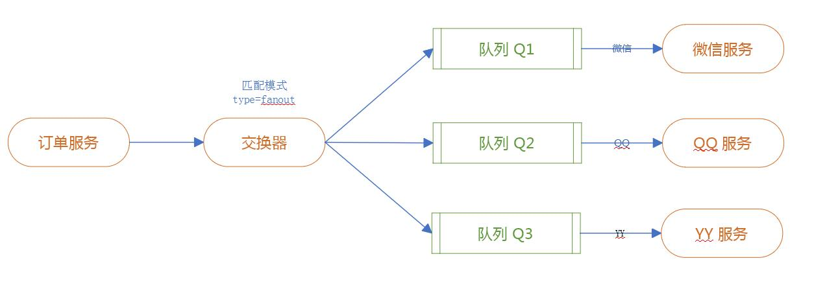

# 交换器fanout模式


## provider(生产者)端代码

#### 生产者配置
```
server.port=8080
spring.rabbitmq.host=3.132.215.12
spring.rabbitmq.port=5672
spring.rabbitmq.username=coffeeliu
spring.rabbitmq.password=111111
#设置交换器
rabbit.exchange=log.fanout
```

#### sender.java
```
@Component
public class Sender {

	@Autowired
	private AmqpTemplate rabbitTemplate;

	@Value("${rabbit.exchange}")
	private String exchange;

	public void send() throws InterruptedException {
		String msg = "hello" + new Date();
		this.rabbitTemplate.convertAndSend(this.exchange, "", msg);
	}
}
```
#### 测试代码
```
	@Autowired
	Sender sender;

	@Test
	void Sender() throws InterruptedException {
		this.sender.send();
	}

```
## consumer(消费者)代码

#### 消费者配置
```
spring.application.name=springboot-amqp
server.port=8080
spring.rabbitmq.host=3.132.215.12
spring.rabbitmq.port=5672
spring.rabbitmq.username=coffeeliu
spring.rabbitmq.password=111111
#设置交换器
rabbit.exchange=log.fanout
rabbit.queue.weixin=order.weixin
rabbit.queue.qq=order.qq
rabbit.queue.yy=order.yy
```
#### weixinReceiver.java
```
@Component
@RabbitListener(bindings=@QueueBinding(
		value= @Queue(value="${rabbit.queue.weixin}",autoDelete="true"),
		exchange=@Exchange(value="${rabbit.exchange}",type=ExchangeTypes.FANOUT)
		)
		)
public class weixinReceiver {
	
	@RabbitHandler
	public void process(String msg){
		System.out.println("weixing处理:"+msg);
	}
}
```
使用bindings对交换器、队列进行绑定。无需对路由键进行操作。
#### qqReceiver.java
```
@Component
@RabbitListener(bindings=@QueueBinding(
		value= @Queue(value="${rabbit.queue.qq}",autoDelete="true"),
		exchange=@Exchange(value="${rabbit.exchange}",type=ExchangeTypes.FANOUT)
		)
		)
public class qqReceiver {
	
	@RabbitHandler
	public void process(String msg){
		System.out.println("qq处理:"+msg);
	}
}
```
#### yyReceiver.java
```
@Component
@RabbitListener(bindings=@QueueBinding(
		value= @Queue(value="${rabbit.queue.yy}",autoDelete="true"),
		exchange=@Exchange(value="${rabbit.exchange}",type=ExchangeTypes.FANOUT)
		)
		)
public class yyReceiver {
	
	@RabbitHandler
	public void process(String msg){
		System.out.println("yy处理 :"+msg);
	}
}
```

## 运行结果

## 消息持久化
将队列中autoDelete属性设置为***false***，此时消息会持久化在rabbit服务器中以供消费者重新上线继续处理消息。
## 消费端故障处理
1. 什么是消息确认ACK？						
如果在处理消息的过程中，消费者服务器、网络、出现故障挂了，那可能这条正在处理的消息就没有完成，数据就会丢失。为了确保消息不会丢失，RabbitMQ支持消息确认–ACK。							
2. ACK的消息确认机制						
"ACK机制是消费者端从RabbitMQ收到消息并处理完成后，反馈给RabbitMQ，RabbitMQ收到反馈后才将此消息从队列中删除。
   + 如果一个消费者在处理消息时挂掉（网络不稳定、服务器异常、网站故障等），那么就不会有ACK反馈，RabbitMQ会认为这个消息没有正常消费，会将此消息重新放入队列中。
   + 如果在集群的情况下：RabbitMQ会立即将这个消息推送给这个在线的其他消费者。这种机制保证了在消费者服务器故障的时候，不丢失任何消息和任务。
   + 消息永远不会从RabbitMQ服务器中删除;只有当消费者正确的发送ACK确认反馈，RabbitMQ确认收到后，消息才会从RabbitMQ服务器的数据中删除。
   + 消息的ACK确认机制默认是打开的。						
3. ACK机制的开发注意事项						
如果忘记了ack，那么后果很严重。当Consumer退出时，Message会一直重新分发。然后RabbitMQ会占用越来越多的内存，由于 RabbitMQ会长时间运行，因此这个“内存泄漏”是致命的。						
4. 处理方式
```
//在properties配置文件中加入
#开启重试
spring.rabbitmq.listener.retry.enabled=true
#重试默认的次数为3
spring.rabbitmq.listener.retry.max-attempts=5
```


