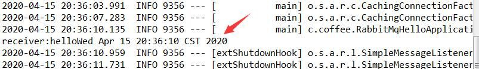

# RabbitMQ简单测试
### application.propertites配置
用以链接rabbitmq服务器
```
spring.rabbitmq.host=3.132.215.12
spring.rabbitmq.port=5672
spring.rabbitmq.username=coffeeliu
spring.rabbitmq.password=111111
```
### 发送者 Sender.java
```
@Component
public class Sender {
	
	@Autowired
	private AmqpTemplate rabbitTemplate;
	
	public void send() throws InterruptedException{
		String msg="hello"+new Date();
		this.rabbitTemplate.convertAndSend("hello-queue", msg);
	}
}
```
### 接受者Receiver.java
```
@Component
public class Receiver {
	
	@RabbitListener(queues="hello-queue")
	public void process(String msg){
		System.out.println("receiver:"+msg);
	}
}
```
### Rabbit注册配置
用以在rabbit服务器持久化一个hello-queue对象
```
@Configuration
public class SenderConfig {
	@Bean
	public Queue aganqueue(){
		return new Queue("hello-queue");
	}
}
```
### 单元测试
Spring Boot提供了一个@SpringBootTest注释，spring-test @ContextConfiguration当您需要Spring Boot功能时，它可以用作标准注释的替代。注释通过创建ApplicationContext在测试中使用过的来SpringApplication起作用。除了@SpringBootTest提供许多其他注释，还用于测试应用程序的更多特定部分。
```
@SpringBootTest
class RabbitMqHelloApplicationTests {
@Autowired
private Sender sender;

@Test
 public void sender() throws InterruptedException {
	sender.send();
	
}
}
```
### 运行结果
