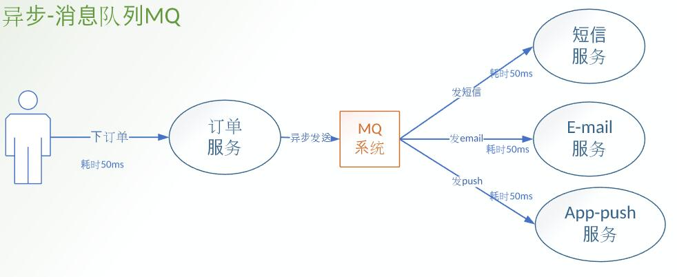

# RabbitMQ简介
### MQ消息队列的技术应用
1. 解耦
解耦是消息队列要解决的最本质问题。
2. 最终一致性
最终一致性指的是两个系统的状态保持一致，要么都成功，要么都失败。
最终一致性不是消息队列的必备特性，但确实可以依靠消息队列来做最终一致性的事情。
3. 广播
消息队列的基本功能之一是进行广播。
有了消息队列，我们只需要关心消息是否送达了队列，至于谁希望订阅，是下游的事情，无疑极大地减少了开发和联调的工作量。
4. 错峰与流控
典型的使用场景就是秒杀业务用于流量削峰场景。
### 优缺点
+ RabbitMQ优点：
由于erlang语言的特性，mq 性能较好，高并发；
吞吐量到万级，MQ功能比较完备
健壮、稳定、易用、跨平台、支持多种语言、文档齐全；
开源提供的管理界面非常棒，用起来很好用
社区活跃度高；
+ RabbitMQ缺点：
erlang开发，很难去看懂源码，基本职能依赖于开源社区的快速维护和修复bug，不利于做二次开发和维护。
RabbitMQ确实吞吐量会低一些，这是因为他做的实现机制比较重。
需要学习比较复杂的接口和协议，学习和维护成本较高。

### 主要解决痛点
+ 同步变异步
  
  
  
+ 解耦

+ 流量削峰

### RabbitMQ简单逻辑

#### 什么是队列？

队列就像存放商品的仓库或者商店，是生产商品的工厂和购买商品的用户之间的中转站。

1. 队列存储了什么？
  在RabbitMQ中，信息流从你的应用程序出发，来到RabbitMQ的队列，所有信息可以只存储在一个队列中。
队列可以存储很多的消息，因为它基本上是一个无限制的缓冲区，前提是你的机器有足够的存储空间。
2. 队列和应用程序的关系？
  多个生产者可以将消息发送到同一个队列中，多个消费者也可以只从同一个队列接收数据。

# RabbitMQ简单测试
### application.propertites配置  
用以链接rabbitmq服务器
```
spring.rabbitmq.host=3.132.215.12
spring.rabbitmq.port=5672
spring.rabbitmq.username=coffeeliu
spring.rabbitmq.password=111111
```
### 发送者 Sender.java
```
@Component
public class Sender {
	
	@Autowired
	private AmqpTemplate rabbitTemplate;
	
	public void send() throws InterruptedException{
		String msg="hello"+new Date();
		this.rabbitTemplate.convertAndSend("hello-queue", msg);
	}
}
```
### 接受者Receiver.java
```
@Component
public class Receiver {
	
	@RabbitListener(queues="hello-queue")
	public void process(String msg){
		System.out.println("receiver:"+msg);
	}
}
```
### Rabbit注册配置
用以在rabbit服务器持久化一个hello-queue对象
```
@Configuration
public class SenderConfig {
	@Bean
	public Queue aganqueue(){
		return new Queue("hello-queue");
	}
}
```
### 单元测试
Spring Boot提供了一个@SpringBootTest注释，spring-test @ContextConfiguration当您需要Spring Boot功能时，它可以用作标准注释的替代。注释通过创建ApplicationContext在测试中使用过的来SpringApplication起作用。除了@SpringBootTest提供许多其他注释，还用于测试应用程序的更多特定部分。
```
@SpringBootTest
class RabbitMqHelloApplicationTests {
@Autowired
private Sender sender;

@Test
 public void sender() throws InterruptedException {
	sender.send();
	
}
}
```
### 运行结果
