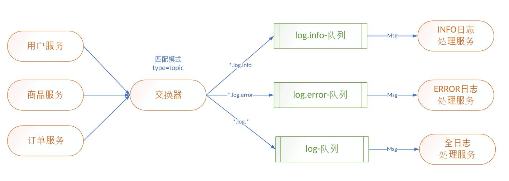

# 交换器topic模式

## 业务场景：系统日志处理场景
1. 微服务产生的日志，交给日志服务器处理
2. 日志处理服务器有4个服务，分别为DEBUG、INFO、WARN、ERROR等
3. 混合发送、接收

## provider(生产者)端代码

#### 生产者配置
```
spring.application.name=springboot-amqp
server.port=8080

spring.rabbitmq.host=3.132.215.12
spring.rabbitmq.port=5672
spring.rabbitmq.username=coffeeliu
spring.rabbitmq.password=111111


#设置交换器
rabbit.exchange=log.topic
```
#### 多生产者
##### OrderSender.java
```
@Component
public class OrderSender {
	
	@Autowired
	private AmqpTemplate rabbitTemplate;
	
	@Value("${rabbit.exchange}")
	private String exchange;
	
	public void send() throws InterruptedException{
		this.rabbitTemplate.convertAndSend(this.exchange,"push.log.debug", "push.log.debug.......");
		this.rabbitTemplate.convertAndSend(this.exchange,"push.log.info", "push.log.info.......");
		this.rabbitTemplate.convertAndSend(this.exchange,"push.log.warn", "push.log.warn.......");
		this.rabbitTemplate.convertAndSend(this.exchange,"push.log.error", "push.log.error.......");
	}
}
```
##### ProductSender.java
```
@Component
public class ProductSender {
	
	@Autowired
	private AmqpTemplate rabbitTemplate;
	
	@Value("${rabbit.exchange}")
	private String exchange;
	
	public void send() throws InterruptedException{
		this.rabbitTemplate.convertAndSend(this.exchange,"product.log.debug", "product.log.debug.......");
		this.rabbitTemplate.convertAndSend(this.exchange,"product.log.info", "product.log.info.......");
		this.rabbitTemplate.convertAndSend(this.exchange,"product.log.warn", "product.log.warn.......");
		this.rabbitTemplate.convertAndSend(this.exchange,"product.log.error", "product.log.error.......");
	}
}
```
##### UserSender.java
```
@Component
public class UserSender {
	
	@Autowired
	private AmqpTemplate rabbitTemplate;
	
	@Value("${rabbit.exchange}")
	private String exchange;
	
	public void send() throws InterruptedException{
		this.rabbitTemplate.convertAndSend(this.exchange,"user.log.debug", "user.log.debug.......");
		this.rabbitTemplate.convertAndSend(this.exchange,"user.log.info", "user.log.info.......");
		this.rabbitTemplate.convertAndSend(this.exchange,"user.log.warn", "user.log.warn.......");
		this.rabbitTemplate.convertAndSend(this.exchange,"user.log.error", "user.log.error.......");
	}
}
```
#### 测试代码
```
@Autowired
	private UserSender userSender;
	
	@Autowired
	private ProductSender productSender;
	
	@Autowired
	private OrderSender orderSender;
	@Test
	public void send() throws InterruptedException {
			this.userSender.send();
			this.productSender.send();
			this.orderSender.send();
			
	}
```
## consumer(消费者)代码

#### 消费者配置
```
spring.application.name=springboot-amqp
server.port=8080
spring.rabbitmq.host=3.132.215.12
spring.rabbitmq.port=5672
spring.rabbitmq.username=coffeeliu
spring.rabbitmq.password=111111
#设置交换器
rabbit.exchange=log.topic
rabbit.info=log.info
rabbit.error=log.error
rabbit.logs=log.msg
```
#### 多消费者
##### ErrorReceiver.java
```
@Component
@RabbitListener(bindings=@QueueBinding(
		value= @Queue(value="${rabbit.error}",autoDelete="true"),
		exchange=@Exchange(value="${rabbit.exchange}",type=ExchangeTypes.TOPIC),
		key="*.log.error"
		)
		)
public class ErrorReceiver {
	
	@RabbitHandler
	public void process(String msg){
		System.out.println("error类型日志:"+msg);
	}
}
```
##### InfoReceiver.java
```
@Component
@RabbitListener(bindings=@QueueBinding(
		value= @Queue(value="${rabbit.info}",autoDelete="true"),
		exchange=@Exchange(value="${rabbit.exchange}",type=ExchangeTypes.TOPIC),
		key="*.log.info"
		)
		)
public class InfoReceiver {
	
	@RabbitHandler
	public void process(String msg){
		System.out.println("info类型日志:"+msg);
	}
}
```
##### LogsReceiver.java
```
@Component
@RabbitListener(bindings=@QueueBinding(
		value= @Queue(value="${rabbit.logs}",autoDelete="true"),
		exchange=@Exchange(value="${rabbit.exchange}",type=ExchangeTypes.TOPIC),
		key="*.log.*"
		)
		)
public class LogsReceiver {
	
	@RabbitHandler
	public void process(String msg){
		System.out.println("all所有日志:"+msg);
	}
}
```
## 运行结果
